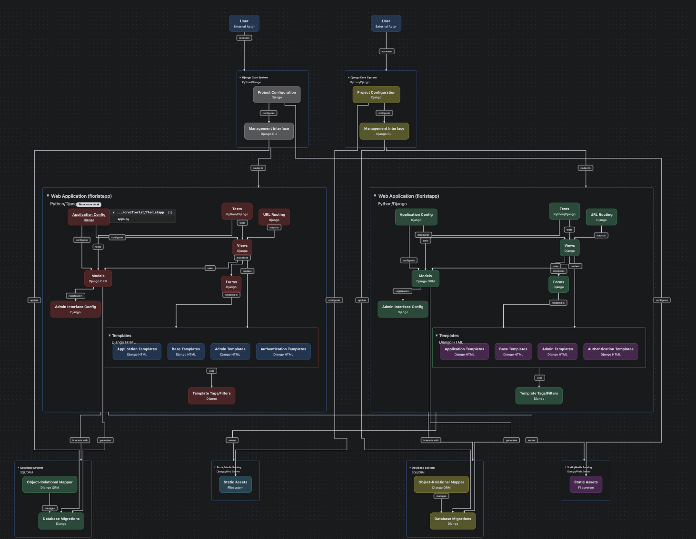
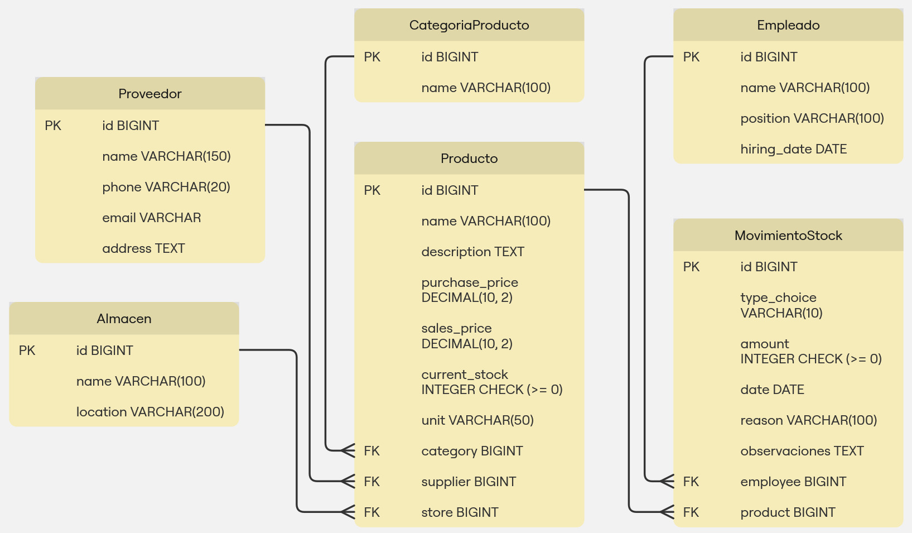

<p align="center">
  
</p>

---

# 🌸 SpikeApp: Tu Floristería Florece con la Tecnología

SpikeApp es una solución integral desarrollada en Django, pensada especialmente para floristerías que buscan optimizar su operativa diaria, reducir errores y maximizar sus beneficios. Gracias a su arquitectura modular, interfaz intuitiva y funcionamiento local, SpikeApp te permite llevar el control total de tu negocio incluso sin conexión a internet.

---

## 🧠 Arquitectura del Proyecto

A continuación se muestra una representación visual de la arquitectura de SpikeApp, basada en Django:



Este esquema muestra la estructura de aplicaciones dentro del proyecto Django, sus componentes principales (Modelos, Vistas, Formularios, URLs, Plantillas, etc.) y cómo interactúan con el sistema de gestión, los usuarios, los assets estáticos y la base de datos.

## Esquema entidad relacion



---

## 🚩 Desafíos Comunes en Floristerías Tradicionales

Las floristerías enfrentan múltiples retos al gestionar procesos de forma manual o con herramientas poco integradas:

- **❌ Control de stock deficiente:** provoca pérdidas por exceso o escasez.
- **❌ Gestión fragmentada:** registros en papel y sistemas aislados.
- **❌ Ineficiencia operativa:** procesos lentos y propensos a errores.
- **❌ Desperdicio de productos:** sin control de inventario ni predicción de demanda.

---

## ✅ SpikeApp: La Solución Todo-en-Uno

SpikeApp centraliza y simplifica la gestión de tu floristería con módulos diseñados para cada área clave del negocio. Es una **aplicación web local, escalable** y de fácil uso.

### 🔧 Características Técnicas

- **Framework principal:** Django (Python)
- **Base de datos:** SQLite / PostgreSQL (según configuración)
- **Acceso local:** no requiere conexión a internet para operar
- **Modular y escalable:** preparada para futuras mejoras

---

## 🧩 Módulos Principales

| Módulo     | Descripción                                                                 |
|------------|------------------------------------------------------------------------------|
| **Productos**  | Gestión completa de flores, ramos y artículos relacionados                 |
| **Almacenes**  | Control preciso de la ubicación y cantidad de productos                    |
| **Empleados**  | Administración de personal y roles                                          |
| **Movimientos**| Registro en tiempo real de entradas y salidas de inventario                |
| **Proveedores**| Base de datos organizada para relaciones comerciales                        |
| **Reportes**   | Informes de ventas, stock y alertas clave                                   |

---

## 🖥️ Interfaz Intuitiva

Diseñada pensando en la experiencia del usuario, SpikeApp ofrece:

- **📊 Dashboard:** resumen visual de ventas, pedidos e inventario
- **📦 Formulario de productos:** fácil de usar para registrar nuevos artículos
- **📈 Movimiento de stock:** control total de entradas y salidas
- **🔐 Login/Registro:** acceso seguro y personalizado

---

## 🔒 Seguridad y Trazabilidad

- **Autenticación segura:** usuarios con login y contraseñas encriptadas
- **Roles personalizables:** controla el acceso según el tipo de usuario
- **Historial de movimientos:** trazabilidad completa por usuario y tiempo

---

## 🌟 Beneficios para tu Negocio

- ⏱️ **Ahorro de tiempo:** automatización de tareas repetitivas  
- 🎯 **Menos errores:** procesos digitales reducen fallos humanos  
- 🗃️ **Mayor orden:** inventario, pedidos y proveedores bien organizados  
- 📊 **Mejores decisiones:** reportes y datos clave en tiempo real  
- 🌿 **Menor desperdicio:** optimización del stock perecedero  

---

## 🔭 Roadmap Futuro

SpikeApp está en constante mejora. Algunas de las funciones planificadas son:

- 📉 **Estadísticas Avanzadas:** análisis predictivo y gráficos dinámicos  
- 🔔 **Notificaciones Automáticas:** alertas de stock bajo o tareas pendientes  
- 💳 **Facturación Integrada:** sistema de pagos y emisión de comprobantes  
- 👥 **Roles Personalizados:** permisos granulares por tarea o área  
- 📱 **App Móvil:** gestiona tu floristería desde cualquier lugar  

---

## 📂 Instalación y Uso

> Sigue estos pasos para instalar y ejecutar el proyecto en tu entorno local:

- Python 3.10 o superior
- Git
- pip
- (Opcional pero recomendado) Virtualenv

### 1. Clonar el repositorio

```bash
git clone https://github.com/Factoria-F5-madrid/proyecto2_GRUPO2
cd tu-repositorio
```
---

## 💡 Contribuciones

¿Te gustaría contribuir al desarrollo de SpikeApp? ¡Estás invitado!

---

## 📬 Contacto

¿Tienes preguntas, sugerencias o deseas colaborar? No dudes en ponerte en contacto:

- **Email:** spikeappteam@spikeapp.com 
- **GitHub:** [Repositorio SpikeApp](#)

---

## 🌸 SpikeApp: Tu Floristería en su Máximo Esplendor

En SpikeApp creemos que una floristería organizada florece más fuerte. Esta plataforma ha sido creada para ayudarte a transformar tu negocio con tecnología accesible, segura y potente.

---

> *"La tecnología no reemplaza tu arte floral, lo potencia."*

